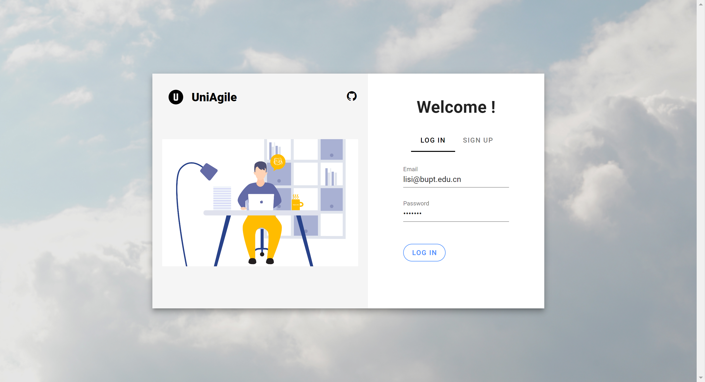

# 2023 spring 计算机学院（国家示范性软件学院）
# 数据结构课程设计 前端

# ds_project

#  项目预览

##  登录及注册

-   用户可以通过"LOG IN"选项进行登录操作，当输入正确的 Email 和 Password 之后，页面会显示“登录成功”，并跳转到“我的主页”。

    

    

    

##  我的主页

-   当用户点击左侧功能导航栏的"我的主页"模块之后，右侧展示用户的姓名、用户类别（分学生和管理员两种）、Email、学号、班级等个人信息，以及学生的学院、专业等院系信息，分别点击“学院、专业、班级”三个模块，即可查看对应的信息。

    

##  课程管理

-   当用户点击左侧功能导航栏的"课程管理"模块之后，右侧展示用户的课程信息，用户可分别切换“日视图、周视图、月视图和每四天的视图”。

-   日视图

    

-   周视图

    

-   月视图

    

-   每四天的视图

    

-   同时，在每个界面，当用户点击某个课程时，可以查看该课程的详细信息。

    

-   如果当前用户为管理员还可以点击左上角的"pencil"图标，对课程信息进行修改操作；或者点击右上角的"delete"图标，对课程进行删除操作。

    

##  日程管理

-   当用户点击左侧功能导航栏的"日程管理"模块之后，右侧从上到下依次展示活动搜索框、用户今日集体活动、用户今日个人活动。

    

-   在活动搜索框中，用户分别可以通过活动名称、活动日期以及活动描述来进行搜索。

-   当用户点击“今日集体活动”或“今日个人活动”右侧的加号时，可以添加集体/个人活动。

    

-   当用户点击每项活动右侧的"pencil"按钮时，可对所选活动的信息进行修改，如下图所示：

    

-   当用户点击"delete"图标时，可以对当前活动进行删除，若删除成功，则会显示“操作成功”的提示。

    

##  地图导航

###  点到点导航方式

-   当用户点击左侧功能导航栏的"地图导航"模块之后，右侧展示北京邮电大学校园平面图，以及地图导航的操作按钮。

    

-   用户点击"选取导航坐标"按钮，之后可以在地图上的相应位置依次进行点击，选取坐标点，选取完成之后，点击"P2P"按钮，完成导航路径规划，再点击“动画展示”按钮，图上将会展示已经规划好的路径。

    

-   此时点击“动画展示”按钮，则会以动画的形式将路径展示出来。（路线上的红点按照规划好的导航路径正在移动）

    

###  途径多点导航方式

-   用户点击"选取导航坐标"按钮，之后可以在地图上的相应位置依次进行点击，选取坐标点，选取完成之后，点击"VIAMANY"按钮，完成导航路径规划，再点击“动画展示”按钮，图上将会展示已经规划好的路径。

    

-   此时点击“动画展示”按钮，则会以动画的形式将路径展示出来（路线上的红点按照规划好的导航路径正在移动），与点到点导航方式不同的是，途径多点导航方式将会按照路径规划的现后顺序，在图上动态展示导航路径。

    

##  模拟系统时间

&emsp;&emsp;在右侧上方的位置，有一排按钮，他们分别实现对模拟系统时间的启动、暂停、加速、减速、继续、翻转、重置和终止的操作。同时根据该模拟系统时间，提示用户第二天的所有事务，以及用户下一个小时内的所有事务，并为用户自动规划导航路径。

-   下一小时事务提醒

    

    

-   第二天事务提醒
    

    

## Project setup
```
npm install
```

### Compiles and hot-reloads for development
```
npm run serve
```

### Compiles and minifies for production
```
npm run build
```

### Customize configuration
See [Configuration Reference](https://cli.vuejs.org/config/).
